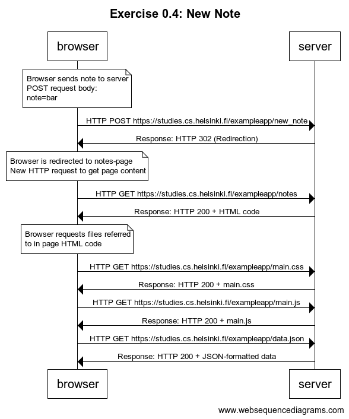

## Exercise 0.4: New Note

Code for WebSequenceDiagrams:

```
title Exercise 0.4: New Note

note over browser:
Browser sends note to server
POST request body: 
note=bar
end note

browser->server: HTTP POST https://studies.cs.helsinki.fi/exampleapp/new_note
server->browser: Response: HTTP 302 (Redirection)

note over browser:
Browser is redirected to notes-page
New HTTP request to get page content
end note

browser->server: HTTP GET https://studies.cs.helsinki.fi/exampleapp/notes
server->browser: Response: HTTP 200 + HTML code

note over browser:
Browser requests files referred
to in page HTML code
end note

browser->server: HTTP GET https://studies.cs.helsinki.fi/exampleapp/main.css
server->browser: Response: HTTP 200 + main.css
browser->server: HTTP GET https://studies.cs.helsinki.fi/exampleapp/main.js
server->browser: Response: HTTP 200 + main.js
browser->server: HTTP GET https://studies.cs.helsinki.fi/exampleapp/data.json
server->browser: Response: HTTP 200 + JSON-formatted data

```

Image:

