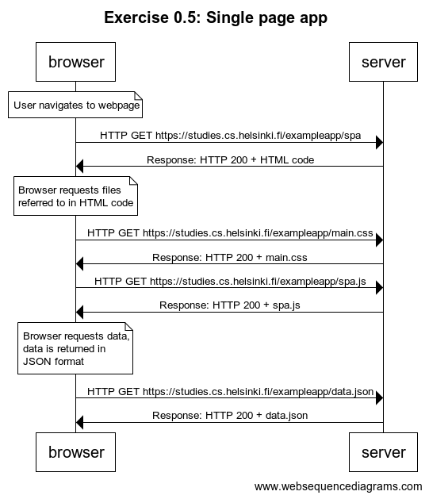

## Exercise 0.5: Single page app

Code for WebSequencedDiagrams:

```
title Exercise 0.5: Single page app

note over browser:
User navigates to webpage
end note

browser -> server: HTTP GET https://studies.cs.helsinki.fi/exampleapp/spa
server -> browser: Response: HTTP 200 + HTML code

note over browser:
Browser requests files
referred to in HTML code
end note

browser -> server: HTTP GET https://studies.cs.helsinki.fi/exampleapp/main.css
server -> browser: Response: HTTP 200 + main.css
browser -> server: HTTP GET https://studies.cs.helsinki.fi/exampleapp/spa.js
server -> browser: Response: HTTP 200 + spa.js

note over browser:
Browser requests data,
data is returned in
JSON format
end note

browser -> server: HTTP GET https://studies.cs.helsinki.fi/exampleapp/data.json
server -> browser: Response: HTTP 200 + data.json
```

Image:

