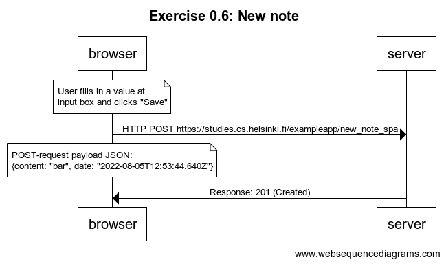

## Exercise 0.6: New note

Code for WebSequenceDiagrams:

```
title Exercise 0.6: New note

note over browser:
User fills in a value at
input box and clicks "Save"
end note

browser -> server: HTTP POST https://studies.cs.helsinki.fi/exampleapp/new_note_spa

note over browser:
POST-request payload JSON:
{content: "bar", date: "2022-08-05T12:53:44.640Z"}
end note

server -> browser: Response: 201 (Created)
```

Image: 
